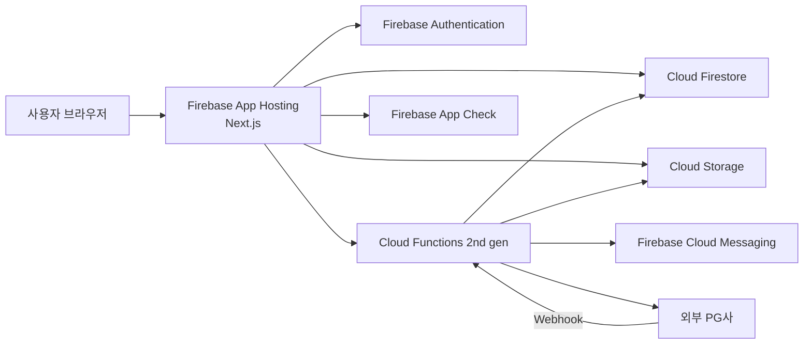

# CARFACTORY(카팩토리) Cursor 개발 전달 문서
## Next.js + Firebase 전용 아키텍처 / Vercel 완전 제외
**Version 1.0 · 2026-07-27**

> 이 문서는 Cursor에 그대로 전달할 수 있는 구현 기준서다. Vercel은 사용하지 않는다.

## 목차
1. [문서 목적](#문서-목적)
2. [서비스 정의와 범위](#서비스-정의와-범위)
3. [전체 시스템 아키텍처](#전체-시스템-아키텍처)
4. [인증 정책: 소셜 로그인 전용](#인증-정책-소셜-로그인-전용)
5. [Next.js 프로젝트 구성](#nextjs-프로젝트-구성)
6. [페이지 및 화면 목록](#페이지-및-화면-목록)
7. [Firestore 데이터 모델](#firestore-데이터-모델)
8. [상품 검색 전략](#상품-검색-전략)
9. [Cloud Storage 경로와 이미지 정책](#cloud-storage-경로와-이미지-정책)
10. [Cloud Functions 목록](#cloud-functions-목록)
11. [주문 및 결제 상태 머신](#주문-및-결제-상태-머신)
12. [Firestore Security Rules 설계](#firestore-security-rules-설계)
13. [Cloud Storage Security Rules 설계](#cloud-storage-security-rules-설계)
14. [Firebase App Check](#firebase-app-check)
15. [SEO 및 공개 상품 렌더링](#seo-및-공개-상품-렌더링)
16. [상태 관리와 데이터 접근 규칙](#상태-관리와-데이터-접근-규칙)
17. [관리자 기능](#관리자-기능)
18. [환경 분리와 비밀정보](#환경-분리와-비밀정보)
19. [Firebase 배포](#firebase-배포)
20. [테스트 전략](#테스트-전략)
21. [구현 단계](#구현-단계)
22. [Cursor 개발 명령문](#cursor-개발-명령문)
23. [MVP 완료 기준](#mvp-완료-기준)
24. [현재 제외 범위](#현재-제외-범위)
25. [공식 참고 문서](#공식-참고-문서)

## 문서 목적

이 문서는 자동차 부품 C2C 거래 플랫폼 **CARFACTORY(카팩토리)**를 Cursor에서 구현하기 위한 최종 개발 기준서다. Cursor는 본 문서를 프로젝트의 최상위 개발 지침으로 간주하고, 화면·데이터·인증·보안·배포 구조를 임의로 변경하지 않는다.

### 최종 기술 방향
- 프론트엔드: Next.js App Router + TypeScript
- UI: Tailwind CSS + shadcn/ui
- 배포: Firebase App Hosting
- 인증: Firebase Authentication
- 데이터베이스: Cloud Firestore
- 이미지 저장: Cloud Storage for Firebase
- 서버 로직: Cloud Functions for Firebase 2nd gen
- 알림: Firebase Cloud Messaging
- 백엔드 보호: Firebase App Check
- 지역: Firestore와 Cloud Functions는 가능한 한 `asia-northeast3`(서울)로 통일

### 절대 조건
1. Vercel을 사용하지 않는다.
2. 별도의 Express, NestJS, ASP.NET, PostgreSQL 서버를 만들지 않는다.
3. 일반 이메일/비밀번호 회원가입을 만들지 않는다.
4. 아이디 찾기, 비밀번호 찾기, 비밀번호 변경 화면을 만들지 않는다.
5. 소셜 로그인만 제공한다.
6. 결제 결과와 주문 상태를 브라우저가 직접 확정하지 않는다.
7. 결제·정산·분쟁·관리자 권한 변경은 Cloud Functions만 수행한다.

## 서비스 정의와 범위

CARFACTORY는 개인 판매자와 개인 구매자가 자동차 부품을 등록하고 검색하고 거래하는 **C2C 자동차 부품 마켓플레이스**다.

### MVP 핵심 기능
- 자동차 부품 검색과 필터
- 상품 상세 정보
- 소셜 로그인
- 판매 상품 등록 및 이미지 업로드
- 찜하기
- 장바구니
- 판매자와 구매자 1:1 채팅
- 주문 및 결제
- 배송 상태 관리
- 구매 확정
- 리뷰
- 신고 및 고객센터 문의
- 마이페이지
- 관리자 운영 기능

### 사용자 역할
| 역할 | 설명 |
|---|---|
| Guest | 로그인 전 사용자. 상품 검색과 상세 열람 가능 |
| User | 로그인 사용자. 구매와 판매를 모두 수행 가능 |
| Support | 문의·신고·분쟁을 처리하는 운영자 |
| Admin | 회원, 상품, 주문, 결제, 운영 데이터를 관리 |
| SuperAdmin | 관리자 권한 부여와 시스템 설정을 관리 |

판매자와 구매자를 별도 회원 유형으로 나누지 않는다. 같은 사용자가 거래에 따라 판매자 또는 구매자가 된다.

## 전체 시스템 아키텍처



### 책임 분리
- **Next.js**: UI, 라우팅, SEO, 사용자 입력, 공개 상품 SSR, Firebase SDK 호출
- **Firebase Authentication**: 로그인 세션과 UID 관리
- **Firestore**: 상품, 사용자, 주문, 채팅, 신고 등 업무 데이터
- **Storage**: 상품 사진, 프로필 사진, 문의 첨부 파일
- **Cloud Functions**: 신뢰가 필요한 서버 로직, 소셜 로그인 커스텀 토큰, 결제 검증, 주문 상태 변경, 알림, 관리자 작업
- **App Hosting**: Next.js 빌드와 배포
- **App Check**: 비정상 클라이언트의 Firestore·Storage·Functions 접근 차단

### 서버 권한 원칙
Firebase Admin SDK는 Cloud Functions와 필요한 Next.js 서버 전용 모듈에서만 사용한다. Admin SDK는 Security Rules를 우회하므로, 사용자 입력을 그대로 신뢰하지 않고 UID·역할·문서 상태를 서버 코드에서 다시 검증한다.

## 인증 정책: 소셜 로그인 전용

### 제공 로그인
- 카카오 로그인
- 네이버 로그인
- Google 로그인
- Apple 로그인은 iOS 앱 또는 사업 요구가 생길 때 추가

### 금지 기능
- 이메일/비밀번호 회원가입
- 이메일/비밀번호 로그인
- 아이디 찾기
- 비밀번호 찾기
- 비밀번호 재설정 메일
- 자체 비밀번호 저장

### Google 로그인
Firebase Authentication의 Google Provider를 사용한다.

### 카카오·네이버 로그인
카카오와 네이버 로그인 성공 후 Cloud Functions가 공급자 토큰을 검증하고 Firebase Custom Token을 발급한다.

```text
사용자 → 카카오/네이버 OAuth 동의
→ OAuth Callback Cloud Function
→ 공급자 Access Token 검증
→ Firebase UID 생성 또는 기존 계정 조회
→ Firebase Custom Token 발급
→ 브라우저 signInWithCustomToken()
→ users/{uid} 프로필 생성 또는 갱신
```

### 계정 연결 기준
- `provider + providerUserId` 조합을 외부 계정의 고유 식별자로 사용한다.
- 이메일은 공급자가 제공하지 않거나 변경될 수 있으므로 주 식별자로 사용하지 않는다.
- 동일 이메일이더라도 공급자가 다르면 자동 병합하지 않는다.
- 계정 병합은 본인 확인이 가능한 별도 기능으로만 수행한다.

### 로그인 화면 요구사항
- 일반 입력창을 표시하지 않는다.
- 카카오, 네이버, Google 버튼만 표시한다.
- 로그인 전에 이용약관과 개인정보처리방침 링크를 제공한다.
- 최초 로그인 후 필수 프로필이 부족하면 닉네임·휴대전화·거래지역 설정 화면으로 이동한다.

## Next.js 프로젝트 구성

### 필수 기준
- Next.js App Router
- TypeScript strict mode
- Server Component를 기본값으로 사용
- 브라우저 API, 상태, Firebase Client SDK가 필요한 부분만 Client Component로 선언
- 절대 경로 별칭 `@/*` 사용
- Zod로 사용자 입력 검증
- React Hook Form으로 폼 상태 관리
- ESLint와 Prettier 적용

### 권장 디렉터리
```text
carfactory/
├─ app/
│  ├─ (public)/
│  │  ├─ page.tsx
│  │  ├─ parts/page.tsx
│  │  └─ parts/[productId]/page.tsx
│  ├─ (auth)/
│  │  ├─ login/page.tsx
│  │  └─ social-callback/page.tsx
│  ├─ (protected)/
│  │  ├─ sell/page.tsx
│  │  ├─ sell/complete/page.tsx
│  │  ├─ cart/page.tsx
│  │  ├─ checkout/page.tsx
│  │  ├─ orders/[orderId]/page.tsx
│  │  ├─ chat/page.tsx
│  │  ├─ chat/[roomId]/page.tsx
│  │  ├─ favorites/page.tsx
│  │  ├─ mypage/page.tsx
│  │  └─ support/page.tsx
│  ├─ admin/
│  ├─ layout.tsx
│  ├─ error.tsx
│  ├─ not-found.tsx
│  ├─ loading.tsx
│  └─ sitemap.ts
├─ components/
│  ├─ ui/
│  ├─ layout/
│  ├─ product/
│  ├─ order/
│  ├─ chat/
│  └─ auth/
├─ features/
│  ├─ auth/
│  ├─ products/
│  ├─ favorites/
│  ├─ cart/
│  ├─ orders/
│  ├─ payments/
│  ├─ chat/
│  └─ support/
├─ lib/
│  ├─ firebase/client.ts
│  ├─ firebase/admin.ts
│  ├─ firebase/converters.ts
│  ├─ validations/
│  ├─ constants/
│  └─ utils/
├─ types/
├─ functions/
│  ├─ src/
│  │  ├─ auth/
│  │  ├─ products/
│  │  ├─ orders/
│  │  ├─ payments/
│  │  ├─ chat/
│  │  ├─ notifications/
│  │  ├─ admin/
│  │  └─ index.ts
│  ├─ package.json
│  └─ tsconfig.json
├─ firestore.rules
├─ firestore.indexes.json
├─ storage.rules
├─ firebase.json
├─ apphosting.yaml
└─ .env.example
```

### 코드 경계
- `lib/firebase/client.ts`: 브라우저 Firebase SDK 초기화
- `lib/firebase/admin.ts`: 서버 전용. 파일 첫 줄에 `import 'server-only'`
- Cloud Functions 코드는 `/functions`에 격리
- React 컴포넌트에서 Admin SDK를 직접 import하지 않는다.
- 컴포넌트에서 Firestore 경로 문자열을 직접 반복하지 말고 repository/service 계층으로 감싼다.

## 페이지 및 화면 목록

### 공개 화면
| 경로 | 화면명 | 로그인 필요 |
|---|---|---|
| `/` | 홈 메인 | 아니오 |
| `/parts` | 부품 검색 결과 | 아니오 |
| `/parts/[productId]` | 부품 상세 | 아니오 |
| `/login` | 소셜 로그인 | 아니오 |
| `/support` | 고객센터 안내 | 아니오/문의 등록은 로그인 |

### 로그인 필요 화면
| 경로 | 화면명 |
|---|---|
| `/sell` | 판매 등록 정보 입력 |
| `/sell/photos` | 판매 사진 등록 |
| `/sell/complete` | 판매 등록 완료 |
| `/favorites` | 찜한 상품 |
| `/cart` | 장바구니 |
| `/checkout` | 주문·결제 |
| `/orders/[orderId]/complete` | 주문 완료 |
| `/chat` | 채팅 목록 |
| `/chat/[roomId]` | 거래 채팅 |
| `/mypage` | 마이페이지 대시보드 |
| `/mypage/products` | 내 판매 상품 |
| `/mypage/orders` | 구매 내역 |
| `/mypage/sales` | 판매 내역 |
| `/mypage/profile` | 프로필·배송지 관리 |
| `/support/inquiries/new` | 문의 등록 |

### 제외 화면
- 일반 회원가입
- 아이디 찾기
- 비밀번호 찾기
- 비밀번호 변경

## Firestore 데이터 모델

### 컬렉션 목록
```text
users
products
categories
vehicleMakes
vehicleModels
orders
payments
chatRooms
chatRooms/{roomId}/messages
reviews
reports
supportInquiries
notifications
adminAuditLogs
systemSettings
```

### users/{uid}
```ts
export interface UserDocument {
  uid: string;
  displayName: string;
  photoURL: string | null;
  email: string | null;
  phoneNumber: string | null;
  providers: Array<"kakao" | "naver" | "google" | "apple">;
  providerAccounts: Array<{
    provider: string;
    providerUserId: string;
  }>;
  defaultRegion: string | null;
  role: "user" | "support" | "admin" | "superAdmin";
  status: "active" | "suspended" | "withdrawn";
  tradeStats: {
    purchaseCount: number;
    saleCount: number;
    ratingAverage: number;
    ratingCount: number;
  };
  termsAcceptedAt: Timestamp;
  privacyAcceptedAt: Timestamp;
  createdAt: Timestamp;
  updatedAt: Timestamp;
  lastLoginAt: Timestamp;
}
```

### products/{productId}
```ts
export type ProductStatus =
  | "draft"
  | "selling"
  | "reserved"
  | "sold"
  | "hidden"
  | "blocked";

export interface ProductDocument {
  sellerUid: string;
  title: string;
  description: string;
  categoryId: string;
  manufacturer: string;
  vehicleMakeId: string;
  vehicleModelId: string;
  vehicleModelName: string;
  modelYearFrom: number | null;
  modelYearTo: number | null;
  partNumber: string | null;
  oemNumber: string | null;
  condition: "new" | "used" | "refurbished";
  conditionDescription: string;
  price: number;
  negotiable: boolean;
  quantity: number;
  deliveryMethods: Array<"parcel" | "direct">;
  shippingFeeType: "included" | "separate" | "cod";
  shippingFee: number;
  region: string | null;
  images: Array<{
    path: string;
    downloadURL: string;
    width: number;
    height: number;
    sortOrder: number;
  }>;
  thumbnailURL: string;
  status: ProductStatus;
  viewCount: number;
  favoriteCount: number;
  chatCount: number;
  createdAt: Timestamp;
  updatedAt: Timestamp;
  soldAt: Timestamp | null;
}
```

### users/{uid}/favorites/{productId}
```ts
{
  productId: string;
  createdAt: Timestamp;
}
```

### users/{uid}/cartItems/{productId}
```ts
{
  productId: string;
  sellerUid: string;
  quantity: number;
  priceSnapshot: number;
  createdAt: Timestamp;
  updatedAt: Timestamp;
}
```

### 주문 분리 원칙
C2C에서는 판매자마다 배송·정산 주체가 다르므로 한 주문은 한 판매자의 상품만 포함한다. 장바구니에 여러 판매자 상품이 있으면 결제 시 판매자별 주문으로 분리한다.

### orders/{orderId}
```ts
export type OrderStatus =
  | "payment_pending"
  | "paid"
  | "preparing"
  | "shipped"
  | "delivered"
  | "purchase_confirmed"
  | "cancel_requested"
  | "cancelled"
  | "disputed"
  | "completed";

export interface OrderDocument {
  orderNumber: string;
  buyerUid: string;
  sellerUid: string;
  productId: string;
  productSnapshot: {
    title: string;
    thumbnailURL: string;
    price: number;
    partNumber: string | null;
  };
  quantity: number;
  itemAmount: number;
  shippingFee: number;
  totalAmount: number;
  status: OrderStatus;
  shippingAddress: {
    recipient: string;
    phone: string;
    postalCode: string;
    address1: string;
    address2: string;
    deliveryMemo: string;
  };
  courier: string | null;
  trackingNumber: string | null;
  paymentId: string | null;
  paidAt: Timestamp | null;
  shippedAt: Timestamp | null;
  deliveredAt: Timestamp | null;
  confirmedAt: Timestamp | null;
  completedAt: Timestamp | null;
  createdAt: Timestamp;
  updatedAt: Timestamp;
}
```

### payments/{paymentId}
```ts
{
  orderId: string;
  buyerUid: string;
  provider: string;
  providerPaymentKey: string | null;
  amount: number;
  currency: "KRW";
  status: "ready" | "paid" | "cancelled" | "failed" | "refunded";
  rawApprovedData: Record<string, unknown> | null;
  createdAt: Timestamp;
  updatedAt: Timestamp;
}
```

### chatRooms/{roomId}
```ts
{
  productId: string;
  buyerUid: string;
  sellerUid: string;
  participantUids: string[];
  lastMessage: string;
  lastMessageAt: Timestamp;
  unreadCountByUid: Record<string, number>;
  status: "active" | "closed" | "blocked";
  createdAt: Timestamp;
  updatedAt: Timestamp;
}
```

### chatRooms/{roomId}/messages/{messageId}
```ts
{
  senderUid: string;
  type: "text" | "image" | "system";
  text: string | null;
  imageURL: string | null;
  createdAt: Timestamp;
  readBy: string[];
}
```

## 상품 검색 전략

### MVP 검색
Firestore 복합 인덱스를 사용하여 다음 필터를 제공한다.
- 제조사
- 차종
- 연식
- 부품 카테고리
- 신품/중고/재생
- 가격 범위
- 직거래 지역
- 판매 상태
- 최신순/낮은 가격순/높은 가격순

### 검색어 처리
Firestore는 일반적인 전문 검색 엔진이 아니다. MVP에서는 다음 정규화 필드를 추가한다.
```ts
searchKeywords: string[];
normalizedTitle: string;
```

예: `BMW F10 5시리즈 운전석 헤드라이트`를 등록할 때 브랜드, 모델, 부품명, OEM 번호 토큰을 `searchKeywords`에 저장한다.

### 확장 시점
상품 수와 검색 요구가 커지면 Algolia 또는 별도 검색 서비스를 추가하되, MVP에서는 추가하지 않는다. 검색 엔진 도입 여부가 결정되기 전까지 인터페이스를 `ProductSearchRepository`로 추상화한다.

## Cloud Storage 경로와 이미지 정책

### 경로 규칙
```text
product-images/{sellerUid}/{productId}/{imageId}.webp
profile-images/{uid}/{imageId}.webp
chat-images/{roomId}/{messageId}.webp
support-files/{uid}/{inquiryId}/{fileId}
```

### 상품 이미지 정책
- JPG, PNG, WEBP만 허용
- 클라이언트에서 긴 변 1600px 이하로 리사이즈
- WEBP 변환 권장
- 이미지 1개 최대 10MB
- 상품당 최대 10개
- 첫 번째 이미지를 대표 이미지로 사용
- Storage 업로드 완료 후 Firestore 문서에 이미지 메타데이터 저장
- 상품 등록 취소 시 고아 파일 정리 함수 실행

### 보안 원칙
- 사용자는 본인의 상품 경로에만 업로드·삭제 가능
- 공개 판매 상품 이미지는 읽기 가능
- 채팅 이미지는 대화 참여자만 읽기 가능
- 문의 첨부파일은 작성자와 운영자만 읽기 가능

## Cloud Functions 목록

모든 Function은 2nd gen으로 작성하고 기본 리전을 `asia-northeast3`로 지정한다.

### 인증
| 함수 | 유형 | 책임 |
|---|---|---|
| `kakaoAuthCallback` | HTTP | 카카오 인증코드 검증, 사용자 매핑, Firebase Custom Token 발급 |
| `naverAuthCallback` | HTTP | 네이버 인증코드 검증, 사용자 매핑, Firebase Custom Token 발급 |
| `onUserCreated` | Auth Trigger | 기본 사용자 문서 생성 |
| `setUserRole` | Callable/Admin | Custom Claims와 사용자 역할 변경 |

### 상품
| 함수 | 유형 | 책임 |
|---|---|---|
| `publishProduct` | Callable | 상품 필수값 검증 후 draft → selling |
| `reserveProduct` | Callable | 주문 생성 시 판매중 → 예약중 원자적 변경 |
| `cleanupOrphanImages` | Scheduled | 참조되지 않는 임시 이미지 제거 |
| `moderateProduct` | Callable/Admin | 상품 숨김·차단 |

### 주문·결제
| 함수 | 유형 | 책임 |
|---|---|---|
| `createOrder` | Callable | 가격·재고·판매상태 검증 후 주문 생성 |
| `preparePayment` | Callable | PG 결제 요청 데이터 생성 |
| `paymentWebhook` | HTTP | PG 서명 검증, 결제 승인 확인, 주문 paid 처리 |
| `markOrderPreparing` | Callable | 판매자가 상품 준비중 처리 |
| `markOrderShipped` | Callable | 판매자가 택배사·운송장 등록 |
| `confirmDelivery` | Callable/System | 배송 완료 처리 |
| `confirmPurchase` | Callable | 구매 확정과 거래 완료 처리 |
| `requestCancel` | Callable | 취소 요청 |
| `refundPayment` | Callable/Admin | PG 환불과 주문 상태 동기화 |
| `openDispute` | Callable | 분쟁 접수와 거래 완료 중지 |

### 채팅·알림
| 함수 | 유형 | 책임 |
|---|---|---|
| `getOrCreateChatRoom` | Callable | 동일 상품·구매자·판매자 채팅방 중복 방지 |
| `onMessageCreated` | Firestore Trigger | 읽지 않은 수 증가, FCM 발송 |
| `onOrderStatusChanged` | Firestore Trigger | 구매자·판매자 상태 알림 |

### 운영
| 함수 | 유형 | 책임 |
|---|---|---|
| `suspendUser` | Callable/Admin | 회원 정지 |
| `resolveReport` | Callable/Admin | 신고 처리 |
| `writeAdminAuditLog` | 내부 | 관리자 작업 감사 로그 기록 |

## 주문 및 결제 상태 머신

```text
payment_pending
  ├─ 결제 성공 → paid
  └─ 결제 실패/만료 → cancelled

paid → preparing → shipped → delivered → purchase_confirmed → completed

paid/preparing
  └─ cancel_requested → cancelled 또는 기존 상태 복귀

paid/preparing/shipped/delivered
  └─ disputed → 운영자 해결 → completed/cancelled/refunded
```

### 필수 규칙
- 가격은 상품 현재 문서에서 서버가 다시 읽는다.
- 클라이언트가 보낸 결제 금액을 신뢰하지 않는다.
- 주문 생성과 상품 예약은 Firestore Transaction으로 처리한다.
- PG 브라우저 성공 페이지를 결제 완료 기준으로 사용하지 않는다.
- PG Webhook 또는 서버 승인 조회 결과만 결제 완료 기준으로 사용한다.
- 판매자가 본인 주문만 발송 처리할 수 있도록 Function에서 UID를 검증한다.
- 구매자가 본인 주문만 구매 확정할 수 있도록 검증한다.
- `completed`, `cancelled`, `refunded` 상태는 클라이언트가 직접 쓰지 못한다.

### 안전결제 관련 주의
실제 판매대금 예치와 판매자 정산은 계약한 PG사의 제공 범위 및 법률 검토 결과에 따라 달라진다. Cursor는 특정 PG사를 임의로 확정하지 말고 `PaymentProvider` 인터페이스로 추상화한다.

## Firestore Security Rules 설계

### 권한 원칙
- 기본값은 거부한다.
- 공개 판매 상품만 비로그인 읽기 허용한다.
- 사용자 프로필의 민감 정보는 공개하지 않는다.
- 사용자는 본인 데이터만 수정한다.
- 주문 금액과 상태는 클라이언트가 수정하지 못한다.
- 채팅은 참여자만 읽고 작성한다.
- 관리자 권한은 Firebase Custom Claims로 판정한다.

### Rules 뼈대
```javascript
rules_version = '2';
service cloud.firestore {
  match /databases/{database}/documents {
    function signedIn() {
      return request.auth != null;
    }

    function isOwner(uid) {
      return signedIn() && request.auth.uid == uid;
    }

    function isAdmin() {
      return signedIn() &&
        request.auth.token.role in ['admin', 'superAdmin'];
    }

    function isSupportOrAdmin() {
      return signedIn() &&
        request.auth.token.role in ['support', 'admin', 'superAdmin'];
    }

    match /users/{uid} {
      allow read: if isOwner(uid) || isSupportOrAdmin();
      allow create: if isOwner(uid);
      allow update: if isOwner(uid)
        && request.resource.data.role == resource.data.role
        && request.resource.data.status == resource.data.status;
      allow delete: if false;
    }

    match /products/{productId} {
      allow read: if resource.data.status == 'selling'
        || resource.data.status == 'reserved'
        || (signedIn() && resource.data.sellerUid == request.auth.uid)
        || isSupportOrAdmin();

      allow create: if signedIn()
        && request.resource.data.sellerUid == request.auth.uid
        && request.resource.data.status == 'draft';

      allow update: if signedIn()
        && resource.data.sellerUid == request.auth.uid
        && request.resource.data.sellerUid == resource.data.sellerUid
        && request.resource.data.price is int
        && request.resource.data.price >= 0
        && request.resource.data.status in ['draft', 'selling', 'hidden'];

      allow delete: if false;
    }

    match /users/{uid}/favorites/{productId} {
      allow read, create, delete: if isOwner(uid);
      allow update: if false;
    }

    match /users/{uid}/cartItems/{productId} {
      allow read, write: if isOwner(uid);
    }

    match /orders/{orderId} {
      allow read: if signedIn() && (
        resource.data.buyerUid == request.auth.uid ||
        resource.data.sellerUid == request.auth.uid ||
        isSupportOrAdmin()
      );
      allow create, update, delete: if false;
    }

    match /payments/{paymentId} {
      allow read: if signedIn() && (
        resource.data.buyerUid == request.auth.uid || isSupportOrAdmin()
      );
      allow write: if false;
    }

    match /chatRooms/{roomId} {
      allow read: if signedIn() && request.auth.uid in resource.data.participantUids;
      allow create, update, delete: if false;

      match /messages/{messageId} {
        allow read: if signedIn()
          && request.auth.uid in get(/databases/$(database)/documents/chatRooms/$(roomId)).data.participantUids;
        allow create: if signedIn()
          && request.resource.data.senderUid == request.auth.uid
          && request.auth.uid in get(/databases/$(database)/documents/chatRooms/$(roomId)).data.participantUids;
        allow update, delete: if false;
      }
    }

    match /supportInquiries/{inquiryId} {
      allow create: if signedIn() && request.resource.data.uid == request.auth.uid;
      allow read: if signedIn() && (
        resource.data.uid == request.auth.uid || isSupportOrAdmin()
      );
      allow update: if isSupportOrAdmin();
      allow delete: if false;
    }

    match /adminAuditLogs/{logId} {
      allow read: if isAdmin();
      allow write: if false;
    }
  }
}
```

실제 배포 전 Emulator Suite에서 허용·거부 케이스 테스트를 작성한다.

## Cloud Storage Security Rules 설계

```javascript
rules_version = '2';
service firebase.storage {
  match /b/{bucket}/o {
    function signedIn() {
      return request.auth != null;
    }

    function validImage() {
      return request.resource.size < 10 * 1024 * 1024
        && request.resource.contentType.matches('image/(jpeg|png|webp)');
    }

    match /product-images/{uid}/{productId}/{fileName} {
      allow read: if true;
      allow write: if signedIn() && request.auth.uid == uid && validImage();
    }

    match /profile-images/{uid}/{fileName} {
      allow read: if true;
      allow write: if signedIn() && request.auth.uid == uid && validImage();
    }

    match /chat-images/{roomId}/{fileName} {
      allow read, write: if false;
    }

    match /support-files/{uid}/{inquiryId}/{fileName} {
      allow write: if signedIn() && request.auth.uid == uid
        && request.resource.size < 10 * 1024 * 1024;
      allow read: if signedIn() && request.auth.uid == uid;
    }
  }
}
```

채팅 이미지와 운영자 문의 파일은 Storage Rules만으로 참여자·운영자 권한을 완전하게 판정하기 복잡할 수 있으므로, 업로드용 Callable Function 또는 제한된 업로드 세션 방식을 우선 검토한다.

## Firebase App Check

### 적용 대상
- Cloud Firestore
- Cloud Storage
- Callable Cloud Functions
- Authentication은 지원 범위와 운영 영향을 확인한 후 단계적으로 적용

### Web 공급자
reCAPTCHA Enterprise를 우선 사용한다.

### 적용 순서
1. 개발 환경에서 Debug Provider 사용
2. 운영 배포 후 요청 지표 관찰
3. 유효 요청이 정상 수집되는지 확인
4. Firestore부터 Enforcement 활성화
5. Storage와 Functions Enforcement 순차 활성화

App Check는 인증을 대체하지 않는다. Authentication, Security Rules, 서버 검증과 함께 사용한다.

## SEO 및 공개 상품 렌더링

자동차 부품은 검색 유입이 중요하므로 상품 상세 페이지는 SEO를 지원한다.

### 요구사항
- `/parts/[productId]`에서 동적 metadata 생성
- 상품명, 차종, 부품번호를 title과 description에 포함
- Open Graph 이미지에 대표 상품 이미지 사용
- 판매 종료 상품은 상태를 표시하되 일정 기간 상세 페이지 유지
- 차단 상품은 404 또는 noindex 처리
- sitemap에 판매중 상품만 포함
- 구조화 데이터 Product 스키마 적용 검토

### 서버 데이터 접근
공개 상품 SSR 읽기에 Firebase Admin SDK를 사용할 수 있다. 단, 공개 가능한 필드만 DTO로 변환하고 사용자 연락처나 내부 운영 필드는 반환하지 않는다.

## 상태 관리와 데이터 접근 규칙

### 상태 관리
- 서버 데이터: Firestore 실시간 구독 또는 TanStack Query 중 기능별 선택
- 로컬 UI 상태: React state 또는 Zustand
- 전역으로 모든 Firestore 데이터를 Zustand에 복제하지 않는다.

### 실시간 구독 권장
- 채팅 메시지
- 주문 상태
- 알림

### 일반 조회 권장
- 상품 목록
- 카테고리
- 마이페이지 통계

### Repository 규칙
```ts
interface ProductRepository {
  getPublicProduct(productId: string): Promise<ProductPublicDto | null>;
  listProducts(filter: ProductSearchFilter): Promise<ProductPage>;
  createDraft(input: CreateProductInput): Promise<string>;
  updateOwnedProduct(productId: string, input: UpdateProductInput): Promise<void>;
}
```
UI 컴포넌트가 Firestore 문서 구조와 직접 결합되지 않도록 DTO와 Repository를 사용한다.

## 관리자 기능

관리자 화면은 동일 Next.js 프로젝트의 `/admin` 하위에 작성한다.

### 권한
- Custom Claims의 `role`을 기준으로 접근 제어
- Middleware의 UI 차단만 믿지 않고, Firestore Rules와 Cloud Functions에서 재검증

### 관리자 화면
- 대시보드
- 회원 조회·정지
- 상품 신고·차단
- 주문·결제 조회
- 취소·환불 관리
- 거래 분쟁 관리
- 고객센터 문의
- 카테고리·차종 관리
- 공지·배너 관리
- 관리자 감사 로그

### 감사 로그
관리자가 회원 정지, 상품 차단, 환불, 역할 변경을 수행하면 `adminAuditLogs`에 다음 내용을 남긴다.
```ts
{
  actorUid: string;
  action: string;
  targetType: string;
  targetId: string;
  before: unknown;
  after: unknown;
  reason: string;
  createdAt: Timestamp;
}
```

## 환경 분리와 비밀정보

### Firebase 프로젝트
운영 안정성을 위해 최소 2개 프로젝트를 사용한다.
```text
carfactory-dev
carfactory-prod
```
가능하면 staging 프로젝트를 추가한다.

### 환경 변수
`.env.local`은 Git에 커밋하지 않는다.

```env
NEXT_PUBLIC_FIREBASE_API_KEY=
NEXT_PUBLIC_FIREBASE_AUTH_DOMAIN=
NEXT_PUBLIC_FIREBASE_PROJECT_ID=
NEXT_PUBLIC_FIREBASE_STORAGE_BUCKET=
NEXT_PUBLIC_FIREBASE_MESSAGING_SENDER_ID=
NEXT_PUBLIC_FIREBASE_APP_ID=
NEXT_PUBLIC_RECAPTCHA_ENTERPRISE_SITE_KEY=
```

카카오 Secret, 네이버 Secret, PG Secret, Webhook Secret은 클라이언트 환경 변수로 두지 않는다. Cloud Secret Manager 또는 Firebase Functions의 Secret Parameter를 사용한다.

### 주의
Firebase Web API Key는 클라이언트 설정값이며 비밀키처럼 취급하지 않는다. 실제 보안은 Authentication, Security Rules, App Check, 서버 검증으로 구성한다. 그러나 서비스 계정 JSON과 OAuth Client Secret은 절대 브라우저 번들 또는 Git 저장소에 포함하지 않는다.

## Firebase 배포

### 배포 구성
- Next.js: Firebase App Hosting
- Functions: Firebase CLI
- Firestore Rules/Indexes: Firebase CLI
- Storage Rules: Firebase CLI

### 배포 흐름
```text
GitHub push
→ Firebase App Hosting 자동 빌드·배포
→ CI에서 lint/typecheck/test
→ Firebase Rules 테스트
→ Functions/Rules 배포
```

### 필수 명령
```bash
npm run lint
npm run typecheck
npm run test
firebase emulators:start
firebase deploy --only firestore:rules,firestore:indexes,storage,functions
```

App Hosting은 Next.js를 지원하며 GitHub 브랜치 푸시를 기준으로 자동 배포하도록 구성한다. Vercel 설정 파일과 Vercel SDK는 프로젝트에 추가하지 않는다.

## 테스트 전략

### 단위 테스트
- 가격 계산
- 주문 상태 전이
- 검색 필터 변환
- Zod 스키마
- 권한 판정 유틸리티

### Emulator 통합 테스트
- 비로그인 사용자가 판매중 상품을 읽을 수 있음
- 비로그인 사용자가 상품을 등록할 수 없음
- 판매자가 타인의 상품을 수정할 수 없음
- 구매자가 타인의 주문을 읽을 수 없음
- 사용자가 주문 상태와 결제 금액을 직접 변경할 수 없음
- 채팅 참여자가 아닌 사용자가 메시지를 읽을 수 없음
- 운영자만 신고 상태를 변경할 수 있음

### E2E 테스트
- 소셜 로그인 후 프로필 완성
- 상품 등록과 이미지 업로드
- 검색 및 찜하기
- 채팅방 생성
- 주문 생성과 결제 테스트 모드
- 판매자 발송 등록
- 구매 확정
- 신고와 문의

### 배포 차단 조건
- TypeScript 오류
- ESLint 오류
- Rules 테스트 실패
- 주문 상태 테스트 실패
- 빌드 실패

## 구현 단계

### 1단계: 프로젝트 기반
- Next.js + TypeScript 프로젝트 생성
- Tailwind CSS와 shadcn/ui 설정
- Firebase 프로젝트 연결
- App Hosting 설정
- Emulator Suite 설정
- 공통 레이아웃과 디자인 토큰 작성

### 2단계: 인증
- Google 로그인
- 카카오 Custom Token 로그인
- 네이버 Custom Token 로그인
- AuthProvider와 보호 라우트
- 최초 로그인 프로필 완성
- 일반 회원가입 관련 코드가 없는지 확인

### 3단계: 상품
- 홈
- 상품 목록과 필터
- 상품 상세
- 판매 등록
- 이미지 업로드
- 내 상품 관리

### 4단계: 거래 보조 기능
- 찜하기
- 장바구니
- 채팅
- 알림

### 5단계: 주문·결제
- 주문 생성
- PG Adapter
- 결제 승인과 Webhook
- 배송과 구매 확정
- 취소와 분쟁

### 6단계: 운영
- 신고
- 고객센터
- 관리자 페이지
- 감사 로그
- App Check Enforcement

### 7단계: 품질
- Rules 테스트
- E2E 테스트
- SEO
- 성능 최적화
- 운영 모니터링

## Cursor 개발 명령문

아래 지시를 Cursor의 프로젝트 규칙 또는 최초 프롬프트로 사용한다.

```text
당신은 CARFACTORY 자동차 부품 C2C 마켓플레이스를 구현하는 시니어 풀스택 개발자다.

[고정 기술]
- Next.js App Router
- TypeScript strict
- Tailwind CSS
- shadcn/ui
- Firebase App Hosting
- Firebase Authentication
- Cloud Firestore
- Cloud Storage for Firebase
- Cloud Functions for Firebase 2nd gen
- Firebase Cloud Messaging
- Firebase App Check

[절대 금지]
- Vercel 사용 금지
- 별도 Express/NestJS/ASP.NET 서버 금지
- PostgreSQL/MySQL 사용 금지
- 이메일/비밀번호 회원가입 및 로그인 금지
- 아이디 찾기/비밀번호 찾기 화면 금지
- 클라이언트에서 결제 완료 또는 주문 완료 상태 직접 쓰기 금지
- 클라이언트 번들에 Firebase Admin SDK, 서비스 계정, OAuth Secret, PG Secret 포함 금지

[인증]
- 카카오, 네이버, Google 소셜 로그인만 구현한다.
- Google은 Firebase Provider를 사용한다.
- 카카오와 네이버는 Cloud Functions에서 OAuth 토큰을 검증하고 Firebase Custom Token을 발급한다.

[코딩 원칙]
- Server Component를 기본으로 사용한다.
- Client SDK가 필요한 컴포넌트에만 'use client'를 선언한다.
- 입력은 Zod로 검증한다.
- Firestore 경로와 쿼리는 repository/service 계층에 둔다.
- 모든 서버 작업은 request.auth.uid와 문서 소유권을 재검증한다.
- 가격, 결제, 주문 상태는 Cloud Functions가 최종 권한을 가진다.
- 모든 날짜는 serverTimestamp를 사용한다.
- 오류는 사용자 메시지와 내부 로그를 분리한다.
- any 타입 사용을 피한다.
- 코드 생성 후 lint, typecheck, test를 실행하고 오류를 수정한다.

[작업 방식]
1. 한 번에 전체 서비스를 만들지 말고 구현 단계를 순서대로 진행한다.
2. 각 단계 시작 전에 생성·수정할 파일 목록을 제시한다.
3. 각 단계 완료 후 실행 명령과 테스트 방법을 제시한다.
4. 데이터 모델 또는 보안 규칙을 변경할 때 본 문서와 충돌 여부를 먼저 확인한다.
5. 요구가 불분명하면 보안과 데이터 무결성을 우선하는 구현을 선택한다.
```

## MVP 완료 기준

다음 조건을 모두 만족해야 MVP 완료로 판단한다.

### 인증
- 카카오, 네이버, Google 로그인 가능
- 이메일/비밀번호 인증 코드와 화면이 존재하지 않음
- 로그인 후 Firebase UID로 사용자 문서가 연결됨

### 상품
- 판매자가 최대 10장의 상품 사진을 등록 가능
- 제조사, 차종, 연식, 카테고리, 상태, 가격 필터 가능
- 공개 상품 상세 페이지가 직접 URL로 접근 가능
- 본인 상품만 수정·숨김 가능

### 거래
- 찜과 장바구니 가능
- 판매자별 주문 분리
- 동일 상품 중복 판매 방지
- PG 테스트 결제 결과를 Webhook으로 검증
- 배송·구매 확정 상태 전이 가능
- 거래 당사자만 주문 조회 가능

### 채팅
- 상품별 1:1 채팅방 생성
- 참여자만 읽기·쓰기 가능
- 새 메시지 알림 발송

### 운영과 보안
- 신고와 문의 가능
- 운영자 화면에서 처리 가능
- 관리자 작업 로그 기록
- Firestore와 Storage Rules 테스트 통과
- App Check 적용
- Vercel 관련 설정·패키지·문서가 없음

## 현재 제외 범위

다음은 MVP에서 제외하고 이후 단계에서 검토한다.
- 판매자 자동 정산 시스템의 최종 구현
- 사업자 판매자 전용 기능
- 세금계산서 자동 발행
- AI 부품 이미지 인식
- VIN 자동 호환성 판정
- 다국어 및 해외 배송
- 네이티브 모바일 앱
- 고급 추천 시스템
- 전문 검색 엔진

## 공식 참고 문서

- Firebase App Hosting: https://firebase.google.com/docs/app-hosting
- App Hosting 작동 방식: https://firebase.google.com/docs/app-hosting/about-app-hosting
- Firebase Authentication: https://firebase.google.com/docs/auth
- Firebase Custom Tokens: https://firebase.google.com/docs/auth/admin/create-custom-tokens
- Cloud Firestore: https://firebase.google.com/docs/firestore
- Firestore Security Rules: https://firebase.google.com/docs/firestore/security/overview
- Firestore Transactions: https://firebase.google.com/docs/firestore/manage-data/transactions
- Cloud Storage for Firebase: https://firebase.google.com/docs/storage
- Storage Security Rules: https://firebase.google.com/docs/storage/security
- Cloud Functions for Firebase: https://firebase.google.com/docs/functions
- Cloud Functions Locations: https://firebase.google.com/docs/functions/locations
- Firebase App Check: https://firebase.google.com/docs/app-check

이 문서는 2026-07-27 기준으로 작성되었다. 실제 개발 시작 전 Firebase 요금제, PG 계약 조건, 개인정보 처리 요건, 전자상거래 및 정산 관련 법률 검토를 별도로 수행한다.
